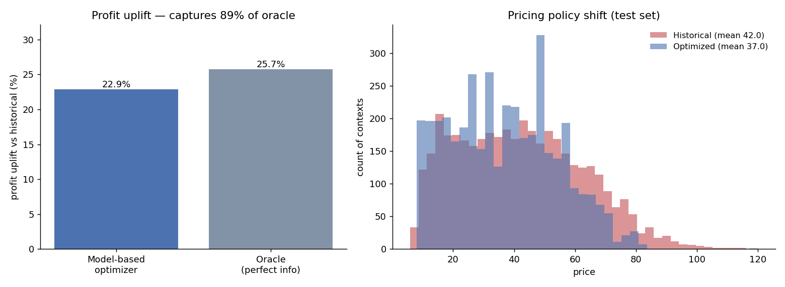
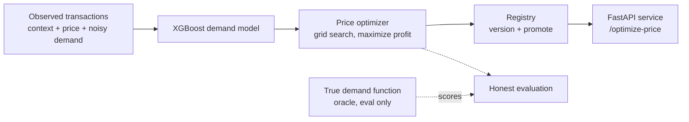

# Dynamic Pricing & Revenue Optimization Engine

**An XGBoost demand model coupled to a profit-maximizing price optimizer, served behind a FastAPI API with a versioned model registry.** The pricing policy is evaluated the honest way, against a known true demand function rather than the model's own predictions, so the reported uplift reflects what the policy would actually earn in deployment.


## What this shows 

- **A real pricing system, not a regressor:** an XGBoost demand model, a profit optimizer on top of it, a model registry with promotion, and an HTTP serving layer, all runnable end to end.
- **A ~22% profit uplift that is honestly measured.** The optimized policy is scored against the true demand function, not the model's own optimistic predictions, and it captures **89% of the oracle ceiling** (the best any policy could do with perfect information).
- **The methodology is the hard part, and it is correct.** Circular evaluation is the most common way pricing results get inflated; this project avoids it by construction and documents exactly how.

## Results



Held-out test set of 4000 contexts, evaluated against true demand, seed 11:

| Metric                                    | Value    |
|-------------------------------------------|:--------:|
| **Profit uplift vs historical policy**    | **22.9%** |
| Oracle ceiling (perfect information)      | 25.7%    |
| Fraction of oracle captured               | 89%      |
| Revenue change (side effect)              | +35.9%   |
| Demand model MAPE (held-out)              | 8.1%     |
| Mean price: historical -> optimized       | 41.96 -> 37.02 |

Reproduce with `python eval/run_eval.py` (about 3 seconds).

The headline is a profit uplift, not a revenue uplift, because unconstrained revenue maximization is degenerate under elastic demand (it drives price to the floor); profit is the objective real pricing systems optimize. The 22.9% is what the model-based policy earns *against the true demand function*, so it already accounts for the model being imperfect. The two numbers that make it trustworthy are the **oracle ceiling** (25.7%, the most any policy could achieve here) and the **captured fraction** (89%): they show the optimizer is close to the best achievable, not just better than a weak baseline. The baseline itself is competitive, a blend of cost-plus and competitor matching, not a strawman. See [ADR 002](docs/adr-002-noncircular-evaluation.md).

## Why evaluation is the hard part

The tempting way to evaluate a pricing optimizer is to score its chosen prices with the same demand model that chose them. That is circular: the optimizer selects exactly the prices the model is most optimistic about, so it always looks brilliant. This project refuses that shortcut.

Because the market is synthetic, the true demand function is known. It is used only to generate noisy training samples and to score policies. The demand model never sees it. So when the optimizer picks a price, the profit it is credited with is the profit that price truly earns, model error included. This is the difference between a number that survives review and one that does not.

## Architecture



## Serving API

The FastAPI app loads whichever model is promoted to the `production` alias in the registry.

```
GET  /health           -> {"status": "ok", "model_version": 1}
POST /predict-demand   -> expected demand at a given price and context
POST /optimize-price   -> profit-maximizing price for a context
```

Example:

```bash
pricing-engine serve &   # uvicorn on :8000

curl -s localhost:8000/optimize-price -H 'content-type: application/json' -d '{
  "context": {"cost": 20, "competitor_price": 45, "segment": 2,
              "season": 0.3, "on_promo": 0, "base_popularity": 3.0}
}'
# -> {"recommended_price": 30.25, "expected_demand": 211.7, "expected_profit": 2171.0, ...}
```

If no model is promoted, the endpoints return 503 rather than serving a random model.

## Model registry

A dependency-light, filesystem-backed registry with the same shape as a hosted one (MLflow, SageMaker):

- monotonic integer versions, each with its serialized artifact, metrics, params, timestamp, and a content hash;
- a `production` alias that serving resolves at request time, so a new model can be promoted without changing code;
- `register`, `promote`, `resolve`, `load`, and `list_versions`.

The evaluation harness trains a model, registers it, and promotes it to production in one run.

## Tech stack

| Concern       | Choice                        | Why                                                             |
|---------------|-------------------------------|-----------------------------------------------------------------|
| Demand model  | XGBoost regressor (log target) | Captures nonlinear, interacting price and context effects.      |
| Optimization  | Grid search on profit          | Transparent, bounded, and economically correct objective.       |
| Registry      | Filesystem + JSON index        | Versioning and promotion with zero external infra.              |
| Serving       | FastAPI + Pydantic             | Typed request validation and a small, testable HTTP surface.    |
| Evaluation    | Oracle-scored policy compare   | Non-circular; measures real deployed value.                     |

## Quickstart

```bash
git clone <your-fork-url> && cd pricing-engine
pip install -e ".[dev]"

# train, evaluate against true demand, register + promote a model
python eval/run_eval.py

# serve the promoted model
pricing-engine serve

# run the tests
pytest -q
```

Everything (sample size, price bounds, XGBoost params, registry path) is set in `src/pricing_engine/config.py` and overridable by environment variable.

## The synthetic market

Each observation is a product in a context (unit cost, competitor price, customer segment, season, promotion flag, popularity) sold at a historical price, producing noisy observed demand. The true demand function has segment-specific price elasticity, a competitor-reference effect with a kink above price parity, seasonality, and a promotion uplift, several of them nonlinear so the modelling problem is non-trivial. The historical policy is a competitive cost-plus-and-competitor blend with realistic price variation. Full detail and rationale are in [ADR 001](docs/adr-001-demand-model-plus-optimizer.md) and the docstrings in `data.py`.

## Testing

12 tests cover the market generator (determinism, downward-sloping demand), the demand model (learns signal, non-negative predictions), the optimizer (respects bounds, non-negative profit), the registry (register, promote, resolve, load, error handling), and the API (health, prediction, optimization, input validation, 503 when no model is promoted). CI runs lint, tests, and a smoke eval on Python 3.10 and 3.12.

## Limitations and honest scope

This is an offline benchmark on synthetic data, so anyone can reproduce it without proprietary datasets. The specific uplift depends on the market regime (how good the historical policy was, how much price variation exists to learn from), which is why the oracle ceiling and captured fraction are reported alongside the headline. Real dynamic pricing also needs online experimentation or causal identification to estimate elasticities without bias, guardrails against feedback loops, and business constraints (inventory, price-change limits, fairness). To run on real data, replace the generator in `data.py` with a loader producing the same context, price, and demand arrays; the model, optimizer, registry, and API are unchanged.

## License

MIT
